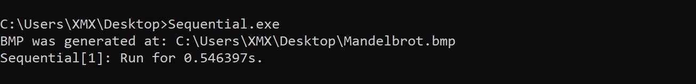
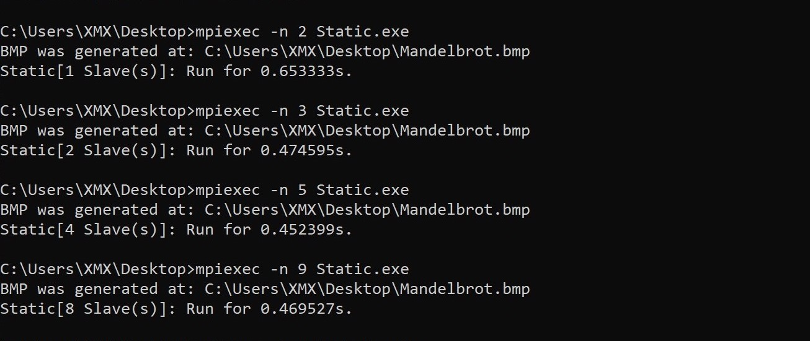
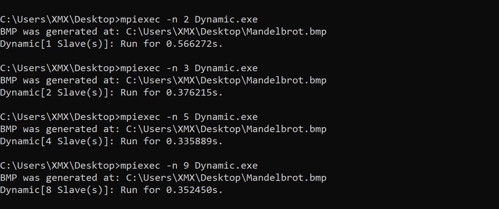

# Mandelbrot Set in 3 Ways (feat. MPI)


### Abstract

3 ways to generate 400x400 BMP image of mandelbrot set.


### Execution & Sample Results

> `-n` specifies the number of processes to be used in Static and Dynamic methods, it should be >= 2 since there's a master.

##### Sequential Method

```bash
> Sequential.exe
```



##### Static Method with MPI

```bash
> mpiexe -n 4 Static.exe
```



##### Dynamic Method with MPI

```bash
> mpiexe -n 9 Dynamic.exe
```



